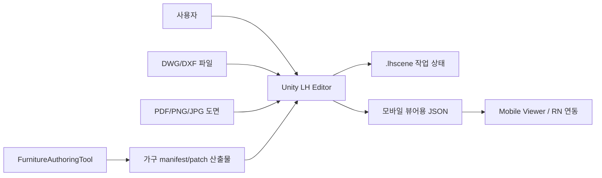
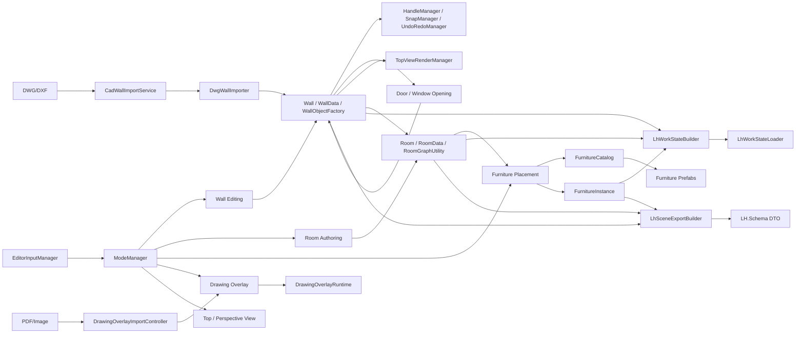

# 시스템 아키텍처 설계서

## 1. 개요

LH Editor Refactoring은 Unity 기반 실내 공간 편집기입니다. 핵심 편집 모델은 벽, 방, 문/창 opening, 가구, 도면 오버레이이며, 최종 결과는 작업 상태 파일(`.lhscene`) 또는 모바일 뷰어용 JSON으로 저장됩니다.

설계의 중심은 다음 네 가지 경계입니다.

- 편집 입력 계층: 사용자 입력을 현재 편집 모드의 명령으로 변환합니다.
- 도메인 편집 계층: 벽, 방, opening, 가구를 씬 오브젝트와 데이터 모델로 유지합니다.
- 영속화 계층: 작업 상태 저장/로드와 외부 export를 분리합니다.
- 저작/연동 계층: DWG/PDF import와 FurnitureAuthoringTool 산출물을 편집 모델에 연결합니다.

## 2. 시스템 컨텍스트



## 3. 주요 모듈

| 모듈 | 경로 | 책임 |
|---|---|---|
| 입력 | `Assets/Scripts/Input` | Unity Input System, 포인터/키보드 상태, UI hit 여부를 `EditorInputFrame`으로 변환합니다. |
| 모드 | `ModeManager.cs` | `EditorMode` 전환, 모드 버튼 바인딩, legacy room mode 정규화를 담당합니다. |
| 벽 편집 | `Assets/Scripts/Draw/Wall` | 벽 생성/선택/이동/삭제, 스냅, 핸들, opening, Undo/Redo, Top view 렌더링을 담당합니다. |
| 방 편집 | `Assets/Scripts/Room` | 방 생성, 방 폴리곤 검증, 벽 연결, 가상 경계, 방 메타데이터를 담당합니다. |
| 도면 오버레이 | `Assets/Scripts/Overlay` | 이미지/PDF import, 보정, 월드 좌표 변환, 오버레이 표시를 담당합니다. |
| CAD import | `Assets/Scripts/Import` | ACadSharp 기반 DWG/DXF 파싱, 레이어 선택, 벽 오브젝트 생성을 담당합니다. |
| 가구 | `Assets/Scripts/Furniture` | 카탈로그 기반 가구 선택, 프리팹 배치, 방 귀속, defect tuple 보관을 담당합니다. |
| 저장/로드 | `Assets/Scripts/ProjectPersistence` | `.lhscene` 작업 상태 DTO 생성, 검증, 복원을 담당합니다. |
| Export | `Assets/Scripts/Export` | LH 모바일 뷰어용 legacy/extended JSON DTO 생성을 담당합니다. |
| UI | `Assets/Scripts/UI` | 씬 계층 트리, 재질 선택, 팝업, 단위 표시 등 편집 UI 보조 기능을 담당합니다. |
| 외부 도구 | `tools/FurnitureAuthoringTool` | 가구 manifest 작성/검증과 향후 patch build 파이프라인을 담당합니다. |

## 4. 컴포넌트 관계



## 5. 데이터 소유권

| 데이터 | 주 소유자 | 저장 대상 | Export 대상 |
|---|---|---|---|
| 벽 geometry, height, thickness, vertex id | `Wall`, `WallData` | 예 | 예 |
| 문/창 opening | `WallOpeningContainer`, `WallOpeningData` | 예 | 예 |
| 방 polygon, room code, texture code | `Room`, `RoomData` | 예 | 예 |
| 가구 배치 transform, code, defect tuple | `FurnitureInstance` | 예 | 예 |
| 도면 오버레이 문서/보정값 | `DrawingOverlayManager`, `DrawingOverlayRuntime` | 현재 아니오 | 아니오 |
| 편집 명령 이력 | `UndoRedoManager` | 아니오 | 아니오 |
| 모바일 business element | Export adapter | 부분 구현 | 후속 과제 |

작업 상태(`.lhscene`)는 편집 재개를 위한 내부 상태이고, export JSON은 외부 모바일 뷰어 계약입니다. 두 계약은 같은 데이터에서 만들어지지만 서로 다른 목적을 가지므로 DTO를 분리해야 합니다.

## 6. 주요 흐름

### 6.1 입력 처리

```text
Unity Input System
-> UnityEditorInputProvider
-> EditorInputManager
-> EditorInputFrame
-> 현재 EditorMode의 IEditorModeInputHandler
```

### 6.2 벽 작성

```text
Default 모드
-> DrawManager
-> WallToolController / WallToolRuntime
-> SnapManager
-> WallObjectFactory
-> Wall / WallData 생성
-> HandleManager 등록
-> UndoRedoManager 기록
-> TopViewRenderManager 갱신
```

### 6.3 DWG/DXF 가져오기

```text
파일 선택
-> CadWallImportService.LoadAvailableLayers
-> 레이어/스케일 선택
-> CadWallImportService.Parse
-> CadWallSegment 목록
-> DwgWallImportSceneApplier
-> WallObjectFactory로 벽 생성
-> HandleManager / RoomManager 갱신
```

### 6.4 도면 오버레이

```text
DrawingOverlayImportController
-> 이미지 로드 또는 PDF 첫 페이지 렌더링
-> DrawingOverlayManager.BeginCalibration
-> OverlayCalibrationPanel / Preview
-> DrawingOverlayCalibrationService.TrySolve
-> DrawingOverlayRuntime.SetDocument
```

### 6.5 저장/로드

```text
저장: LhWorkStateBuilder -> LhWorkStateDto -> JsonUtility -> .lhscene
로드: .lhscene -> JsonUtility -> LhWorkStateLoader -> 벽/방/가구 복원 -> UI 갱신
```

### 6.6 Export

```text
LhSceneExporter
-> WallHierarchyUtility.CollectWalls
-> RoomManager.RefreshAllRooms
-> LhSceneExportBuilder
-> LH.Schema DTO
-> JsonUtility
-> JSON 파일
```

## 7. 외부 의존성

| 의존성 | 용도 |
|---|---|
| Unity Input System `1.17.0` | 편집 입력 처리 |
| Unity UGUI `2.0.0` | 런타임 UI |
| URP `17.0.4` | 렌더링 파이프라인 |
| Unity Test Framework `1.6.0` | Editor 테스트 |
| ACadSharp | DWG/DXF 파싱 |
| Paroxe PDFRenderer | PDF 도면 렌더링 |
| TextMesh Pro | UI 텍스트 |
| .NET 7 WPF | FurnitureAuthoringTool |

## 8. 현재 한계

- Export v2의 `elements`, `defectCatalog`, 명시적 room-owned selectable target은 아직 구현 근거가 부족합니다.
- 도면 오버레이는 보정 결과가 work state에 저장되지 않습니다.
- `DrawingOverlaySceneBootstrap`, `DwgWallImporter`는 UI, OS interop, 처리, scene apply 책임이 커서 분리 필요성이 있습니다.
- FurnitureAuthoringTool은 manifest 작성까지는 가능하지만 Unity Build Worker와 LH Editor 런타임 패치 로더가 미완입니다.
- 복잡한 3D wall join/miter mesh는 후속 설계가 필요합니다.
- 자동 room split/merge는 현재 주요 사용자 흐름이 아니므로 보류 또는 feature flag 대상입니다.
